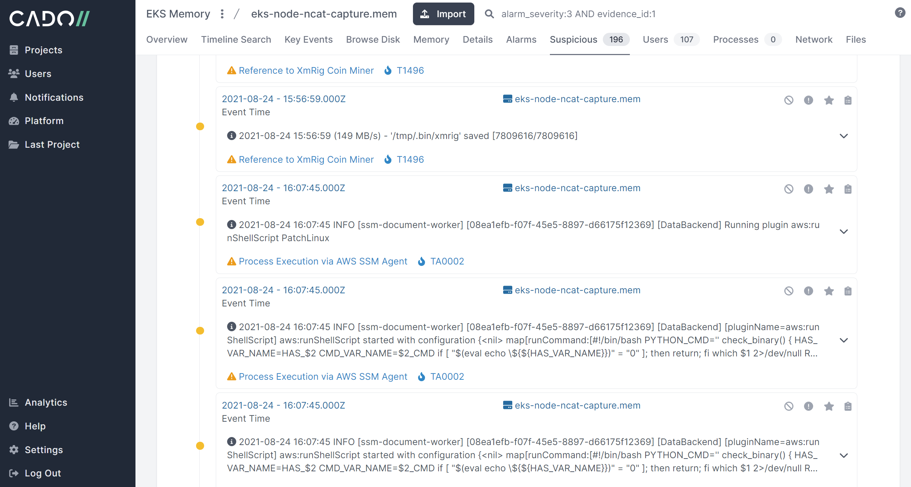
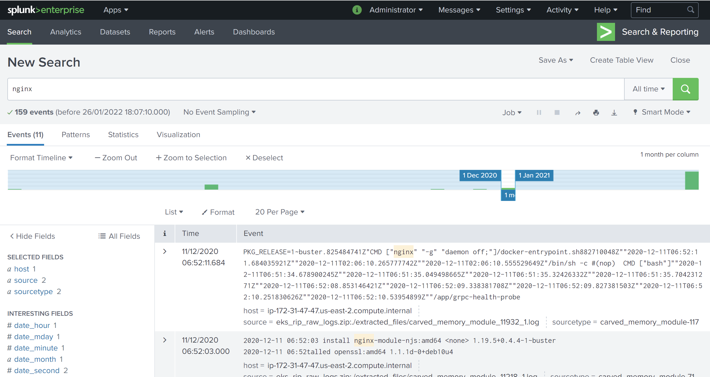

# Rip Raw #
Rip Raw is a small tool to analyse the memory of compromised Linux systems.
It is similar in purpose to Bulk Extractor, but particularly focused on extracting system Logs from memory dumps from Linux systems. This enables you to analyse systems without needing to generate a profile.

This is not a replacement for structured memory analysis tools such as Rekall and Volatility which use a profile to perform a more structured analysis of memory.

Rip Raw works by taking a Raw Binary such as a Memory Dump and carves files and logs using:

* Text/binary boundaries

* File headers and file magic

* Log entry

Then puts them in a zip file for secondary processing by other tools such as Cado Response or a SIEM such as Splunk (examples below).

### Example ###

For example, after capturing the memory of an Amazon EKS ( Elastic Kubernetes Service) system compromised with a crypto-mining worm we processed it with rip_raw:

    python3 rip_raw.py -f eks-node-ncat-capture.mem
 
And then the large zip of logs that Rip Raw outputs can be viewed in a tool such as Cado Response (below). Approximately **36500 log events** were extracted from this memory image, along with a number of binaries such as images and executables.

Or Splunk:

### Learn More ###

* We'll be giving a webinar on Cloud Incident Response and Ransomware on Tuesday February 1st @ <https://www.brighttalk.com/webcast/19071/527346>

* We give an example of Rip Raw for analysing a compromised Amazon Kubernetes system in a talk @ <https://offers.cadosecurity.com/cloud-and-kubernetes-memory-forensics>

* You can download a PDF copy of our playbook on how to respond to compromised Kubernetes systems such as Amazon EKS @ <https://offers.cadosecurity.com/the-ultimate-guide-to-docker-and-kubernetes-incident-response>